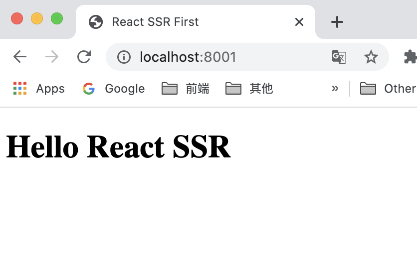

# 实现最基本的ssr

写一个hello world

## 准备工作

<b>安装 `react` 库</b>
```bash
npm i react react-dom
```

react 代码不能直接运行，需要先经过 babel 编译。

```bash
npm i @babel/core @babel/cli @babel/preset-react
```

## 开始编写代码

```js
const React = require("react")
const { renderToString } = require("react-dom/server")

const http = require("http")

// 创建一个组件
class Index extends React.Component {
  constructor(props) {
    super(props)
  }
  render() {
    return <h1>hello react ssr{this.props.name}</h1>
  }
}

http.createServer((req, res) => {
  res.writeHead(200, {
    'Context-Type': 'text/html'
  })
  // 将React组件转换为 html
  const html = renderToString(<Index name="😄" />)

  res.end(`
    <!DOCTYPE html>
    <html lang="en">
    <head>
      <title>Document</title>
    </head>
    <body>
      ${html}
    </body>
    </html>
  `)
}).listen(8001, () => {
  console.log('react ssr run in http://localhost:8001')
})
```

## 代码编译

使用 `babel` 进行代码转换

```bash
npx babel index.js --out-file index-build.js --presets=@babel/preset-react
```

运行编译后的文件`index-build.js`

```
node index-build.js
```

打开浏览器访问 `http://localhost:8001`

